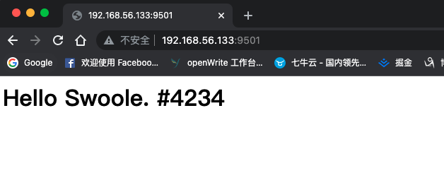

# 先把Swoole跑起来

在对 Swoole 有一个初步的印象之后，今天我们就来简单地搭建起 Swoole 环境并且运行起一个简单的 Http 服务。大家不用太有压力，今天的内容还没有太多理论方面的东西，一步步地一起把运行环境先准备好，能看到 Swoole 运行起来的效果就可以了。

## 环境准备

其实安装 Swoole 扩展并不麻烦，和其它的 PHP 扩展一样的安装过程就可以了。不过需要注意的是，Swoole 会和一些扩展产生冲突，比如说 XDebug、phptrace、aop、molten、xhprof、phalcon（协程无法运行在 phalcon 框架中）。

大家一定会担心了，不能使用 XDebug ，我们的调试会很麻烦呀！没关系，Swoole 也有它自己推荐的调试工具，有兴趣的小伙伴可以自己查阅下相关资料。

如果你是 Windows 环境，由于操作系统差异的问题，并没有直接的 dll 扩展包可以使用。所以在 Windows 环境下最好是建一个虚拟机，然后设置 PHPStrom 的同步就可以方便地进行开发了。这个配置我就不多说了，百度一搜一大堆。

在这里，我也是通过虚拟机安装的，系统环境为 CentOS8、PHP8.1、Swoole4.8.3、MySQL8.0.27 都是最新的，如果你是 PHP7 以及 Swoole4.4 的话也是没问题的，不会有很大的区别。其它的工具，比如 Nginx、Redis 等，大家可以根据情况安装，我们在后续的课程中也会用到。

扩展安装成功后，在 php.ini 文件中加上扩展信息，然后就可以通过下面的命令行查看 Swoole 的版本信息以及扩展配置情况。

```php
[root@localhost ~]# php --ri swoole

swoole

Swoole => enabled
Author => Swoole Team <team@swoole.com>
Version => 4.8.3
Built => Dec  7 2021 22:01:03
coroutine => enabled with boost asm context
epoll => enabled
eventfd => enabled
signalfd => enabled
cpu_affinity => enabled
spinlock => enabled
rwlock => enabled
zlib => 1.2.11
mutex_timedlock => enabled
pthread_barrier => enabled
futex => enabled
async_redis => enabled

Directive => Local Value => Master Value
swoole.enable_coroutine => On => On
swoole.enable_library => On => On
swoole.enable_preemptive_scheduler => Off => Off
swoole.display_errors => On => On
swoole.use_shortname => On => On
swoole.unixsock_buffer_size => 8388608 => 8388608
```

## 启动一个服务

相信各位大佬对环境和扩展的安装都是没问题的，如果有问题的话，问我也没用，编译安装这些东西有很多玄学（懵逼）问题存在的，只能是多拿虚拟机练手玩了。环境安装成功后，我们就先来简单地搭建一个 Http 服务吧。

什么？直接起一个 Http 服务？不是要用 Nginx 或者 Apache 吗？忘了上篇文章中我们说过的东西了吧，Swoole 是直接启动服务的，而不是像传统的 PHP 使用 FastCGI 来启动 php-fpm 这种形式的。或者，你也可以理解为直接使用 Swoole 启动的服务就是 php-fpm 使用连接形式启动的那个 9000 端口的服务。

关于 php-fpm 相关的知识，我们之前在 **了解PHP-FPM** [https://mp.weixin.qq.com/s/NUpDnfYfbPuWmal4Am3lsg](https://mp.weixin.qq.com/s/NUpDnfYfbPuWmal4Am3lsg) 中有过详细的说明，大家可以回去看看哦。

好了，让我们进入正题，先新一个文件，然后输入下面的代码。

```php
<?php
$http = new Swoole\Http\Server('0.0.0.0', 9501);

$http->on('Request', function ($request, $response) {
    echo "接收到了请求";
    $response->header('Content-Type', 'text/html; charset=utf-8');
    $response->end('<h1>Hello Swoole. #' . rand(1000, 9999) . '</h1>');
});

echo "服务启动";
$http->start();
```

将它放到开启了 Swoole 环境的系统中，然后去执行命令行脚本运行它。

```php
[root@localhost source]# php 2.1先把Swoole跑起来.php
服务启动
```

一运行起来命令行就停住了，很明显，现在程序已经被挂载起来了。然后我们去浏览器访问页面，如果是本机的话，直接 http://localhost:9501 就可以了，如果是虚拟机，访问虚拟机的 IP 地址并加上端口号。注意，访问失败的话可以检查下有没有关掉防火墙。

访问页面的结果可以看到如下截图。



同时，命令行中也会输出下面的内容。

```php
[root@localhost source]# php 2.1先把Swoole跑起来.php
服务启动接收到了请求
```

恭喜你，你的 Swoole 环境没有任何问题哦，现在一个最简单的 Http 服务器已经搭建成功啦！

接下来，我们尝试修改一下文件内容，像上面的输出信息并没有换行，我们把换行符加上吧。

```php
// .....
    echo "接收到了请求", PHP_EOL;
// .....

echo "服务启动", PHP_EOL;
```

再次请求页面，你会发现命令行中输出的内容还是没有换行，这是为什么呢？

还记得我们在上篇说过的动态语言与静态语言的问题吧，现在的 Swoole 其实就已经是类似静态语言的运行方式了。它已经将程序挂载起来成为一个独立的进程，其实这个时候就相当于已经编译成了一个类似于 jar 或者 exe 的文件，并且直接运行起来了。因此，我们修改文件是不会对当前进程中的程序产生任何影响的。如果要更新修改之后的内容，就需要重新启动服务。现在就 Ctrl+C 先关闭应用，然后再命令行执行一下吧。你会看到输出就会有换行了。

```php
[root@localhost source]# php 2.1先把Swoole跑起来.php
服务启动
接收到了请求
接收到了请求
接收到了请求
接收到了请求
```

## echo 为什么打印在命令行了

相信不少同学又会有一个疑问，为什么 echo 被输出到命令行了？传统的 PHP 开发中，我们的 echo 是直接输出到页面了呀？

这就是另一个 Swoole 与传统开发的不同。在 Swoole 中，我们的服务程序是使用命令行挂起的，我们上面的代码其实在内部是实现了一个 Http 服务功能，而不是通过 php-fpm 去输出给 Nginx 这种服务器的。转换一个角度来想，php-fpm 也只是把这些输出交给了服务器程序，然后由服务器程序原样给输出到页面上。但是在 Swoole 中，echo 之类的输出流是直接将结果发送到操作系统对应的 stdout 上了。相对应地，我们的服务输出则是直接通过 Swoole 代码中的服务回调参数上的 response 对象来进行服务流输出过程的。

这个地方的思维是需要大家转变一下的。如果你学习过 Java 开发的话对这里应该不会陌生，在 Swoole 环境下，echo（print、var_dump()等等）之类的传统输出就变成了 Java 中的 System.out.println() 。同样，在 Java 中，不管什么框架，你要输出页面上的结果值，也是通过类似于一个 Response 对象来实现的。其实，就只是将我们打印的内容输出到了不同的流上，普通的打印流到了 stdout 上，而 Response 对象则是通过 TCP 将结果输出到了响应流上。这一块的原理就很深了，至少得要更深入的学习网络相关的知识，可惜目前的我水平还达不到，所以有兴趣的小伙伴还是自己去查阅相关的资料吧！

## 总结

今天的学习内容不多，最主要的是我们先了解一下最简单的 Http 服务是如何跑起来的，以及在输出方面与传统开发模式的异同。当然，更重要的是，你现在得要把开发环境准备好。否则后续的内容就没法跟着一起实践了哦。

测试代码：

[https://github.com/zhangyue0503/swoole/blob/main/2.基础/source/2.1先把Swoole跑起来.php](https://github.com/zhangyue0503/swoole/blob/main/2.基础/source/2.1先把Swoole跑起来.php)

参考文档：

[https://wiki.swoole.com/#/environment](https://wiki.swoole.com/#/environment)

[https://wiki.swoole.com/#/start/start_http_server](https://wiki.swoole.com/#/start/start_http_server)
