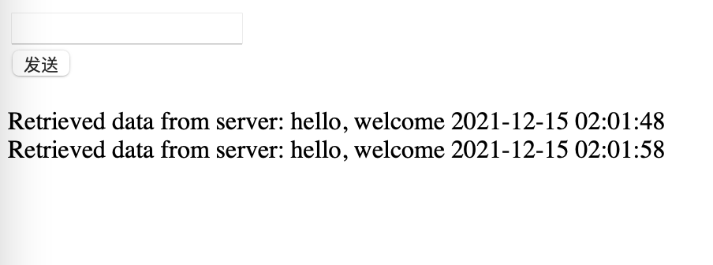
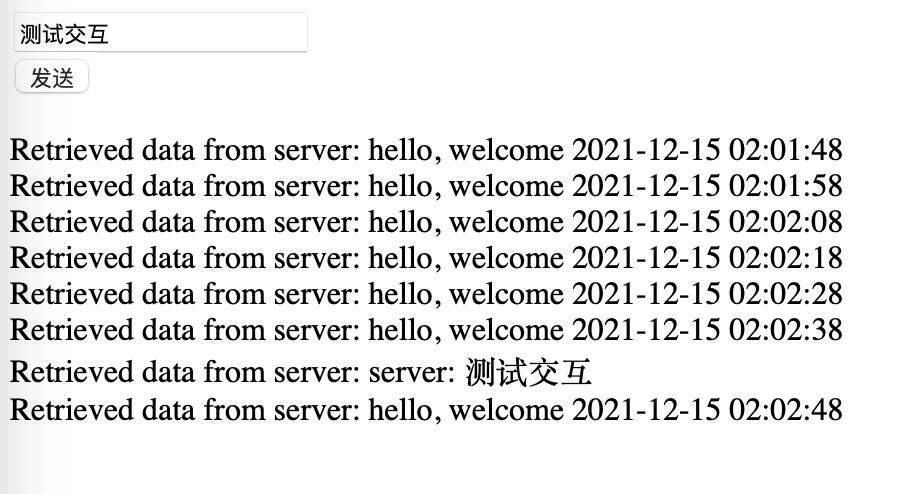

# WebSocket服务

对于 Web 应用来说，最主流的当然就是我们之前学习过的 Http、TCP、UDP 这一类的应用。但是，最近这些年，特别是 HTML5 成为主流之后，WebSocket 应用日益丰富起来。要知道，之前我们在做后台时，如果要做消息通知之类的应用，全都是使用 JQuery 来进行 Ajax 轮询的。对于后台来说，这么做问题不大，但是如果你是要在前端页面做类似的功能，特别是一些客服功能的话，那可就费劲了。

关于 WebSocket 的好处我也不多说了，大家可以自己去查阅一下相关的资料。最主要的是，它建立起来的是一个持久的长链接，不需要像轮询一样不停地发送 Http 请求，能够非常有效地节省服务器资源。

之前我们在 Laravel 系列课程中就学习过它的 广播系统 ，这个 广播系统 正是基于 WebSocket 来实现的，并且还运用了 Laravel 框架中的队列、事件等等一系列的功能。在当时，我们还要下载一个 larave-echo-server ，大家对这个还有印象不？这个东西也是一个 WebSocket 服务端。通过消化 Laravel 中的队列来实现 WebSocket 的消息发送。

在 Swoole 中，搭建起一个 WebSocket 服务非常简单，话不多说，我们直接就搭建起来看看吧。

## 服务端

对于服务端来说，WebSocket 服务也是继承自 Server 对象的，所以它的大部分方法都差不多，同样我们也是需要像 TCP 一样去监听一些事件的。

```php
//创建WebSocket Server对象，监听0.0.0.0:9501端口
$ws = new Swoole\WebSocket\Server('0.0.0.0', 9501);

//监听WebSocket连接打开事件
$ws->on('Open', function ($ws, $request) {
    while(1){
        $time = date("Y-m-d H:i:s");
        $ws->push($request->fd, "hello, welcome {$time}\n");
        Swoole\Coroutine::sleep(10);
    }
});

//监听WebSocket消息事件
$ws->on('Message', function ($ws, $frame) {
    echo "Message: {$frame->data}\n";
    $ws->push($frame->fd, "server: {$frame->data}");
});

//监听WebSocket连接关闭事件
$ws->on('Close', function ($ws, $fd) {
    echo "client-{$fd} is closed\n";
});


$ws->start();
```

在 WebSocket 中，我们监听的主要是 Open 建立连接、Message 消息推送和 Close 连接关闭的事件。

当我们的客户端连接到服务时，就会触发 Open 监听，其中在 $request 中会返回连接的 fd 信息，这是一个句柄，或者说是标识我们的客户端的一个标志。然后我们在 Open 监听中每隔十秒去发送一条消息，假装是一个后台的通知信息。

注意，在这里我们不是直接使用 PHP 的那个 sleep() 函数，为什么呢？因为在 Swoole 应用中，sleep() 这一类的原生函数会直接暂停整个程序的执行，在暂停的过程中，是无法接收到任何请求消息的，不管你是进程、线程还是协程，都会暂停住。所以，我们应该使用 Coroutine::sleep() 这个 Swoole 提供的休眠函数。它会只针对当前的进程进行休眠。

当然，你可以尝试一下使用普通的 sleep() ，你也能正常接收到 push() 的信息，但是，我们后面监听 Message 这一块的内容你可能就无法测出来了。我们马上来说这 Message 的监听。

它主要监听的是客户端发来的信息，当接收到客户端发来的信息后，我们直接打印信息，并将客户端发来的信息再返回给客户端表示我们收到信息了。

最后，在连接关闭的时候会监听到 Close 事件中。

整个 WebSocket 最核心的内容就是监听这三个事件。现在你可以在测试环境中将服务运行起来了。我们马上再来写前端代码实现客户端。

## 前端

对于客户端来说，我们也使用最基础的原生 JS 中的 WebSocket 写法来测试。

```html
<!DOCTYPE html>
<html lang="en">
<head>
    <meta charset="UTF-8">
    <title>Title</title>
</head>

<body>

<input type="text" id="txt"/><br/>
<button onclick="send()">发送</button>

<p id="response">

</p>

<script type="text/javascript">
  var wsServer = 'ws://192.168.56.133:9501';
  var websocket = new WebSocket(wsServer);
  websocket.onopen = function (evt) {
    console.log("Connected to WebSocket server.");
  };

  websocket.onclose = function (evt) {
    console.log("Disconnected");
  };

  websocket.onmessage = function (evt) {
    console.log('Retrieved data from server: ' + evt.data);
    document.getElementById("response").innerHTML = document.getElementById("response").innerHTML + 'Retrieved data from server: ' + evt.data + '<br/>';
  };

  websocket.onerror = function (evt, e) {
    console.log('Error occured: ' + evt.data);
  };


  function send(){
      websocket.send(document.getElementById('txt').value);
  }

</script>
</body>
</html>
```

在这个页面中，我们定义了一个文本输入框和一个按扭用于发送消息给服务端。另外下面还有一个 p 标签用于显示服务端的消息内容。

在 JS 代码中，我们直接使用的就是原生的 WebSocket 对象。它同样是需要监听三个主要的方法，和服务端也是一一对应的，分别就是 onopen()、onclose() 和 onmessage() 方法。另外还有一个 send() 方法是上面的按扭调用的，当点击按扭后，将文本输入框中的内容通过 WebSockent 的 send() 方法发送给服务端。

这个页面运行起来是这个样子的。



正常情况下现在已经建立起了和服务端的 WebSocket 通信，所以在按扭下方的 p 标签中会有内容一直在打印出来。我们可以在文本框中输入文字，马上就能看到输入的文字信息被返回回来了。



## 总结

怎么样，还是比较简单吧，我们非常轻松地就搭起来了一个 WebSocket 服务。我们现在还是在入门学习阶段，所以东西还比较简单，不过话说回来，确实在官方文档上对于这些服务也没什么太多的内容，毕竟核心的确实就是去监听几个事件就好了，其它的工作框架在底层都帮我们解决好了。

好吧，没法去研究底层，毕竟自己的 C/C++ 水平也就仅限于写个冒泡的水平了（也不定能写出来了...）。不过没关系，我们一起加油，至少要把 Swoole 的基础应用都掌握好了，而且今天我们又发现了一个问题，那就是普通的 sleep() 函数在 Swoole 中的使用是会有问题的，这不也就是一种收获嘛。

测试代码：

参考文档：

[https://wiki.swoole.com/#/start/start_ws_server](https://wiki.swoole.com/#/start/start_ws_server)
