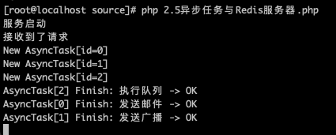
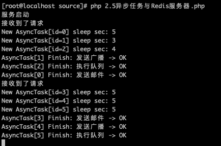
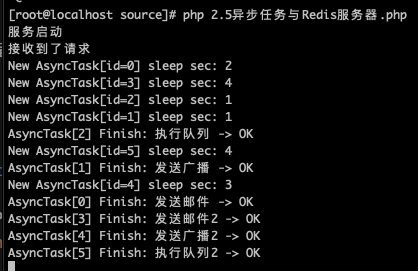

# 异步任务

异步任务又是什么东西？在我们前面的学习中讲过一个全局变量的问题，当时我们给服务设置了一个 worker_num 属性，这是一个工作者进程的设置。在设置了之后启动 Swoole 之后，我们通过 ps 命令可以查看到运行的程序多了几个进程出现。现在，你应该了解到了 Worker 是一种进程。不过，我们今天要讲的是另一种进程形式，叫做 Task 进程。

## 使用异步任务

关于进程之类的知识我们在后面的进阶中再学习，现在你可以先把 Task 看成是 Worker 新开出的一种用于执行耗时操作的进程。一般可以用于发送广播、邮件等等，这些长耗时操作可能带来的是进程的阻塞，会影响服务的执行效率。或者，先简单点理解，如果你接触过 Java 的话，可以将这个 Task 暂时理解成 Java 中的 Thread 线程（注意，在 Swoole 中，Task 被标明为进程）。我们可以这样来使用它。

```php
$http = new Swoole\Http\Server('0.0.0.0', 9501);

$http->set([
    'task_worker_num'=>4,
]);

$http->on('Request', function ($request, $response) use($http) {
    echo "接收到了请求", PHP_EOL;
    $response->header('Content-Type', 'text/html; charset=utf-8');

    $http->task("发送邮件");
    $http->task("发送广播");
    $http->task("执行队列");

    $response->end('<h1>Hello Swoole. #' . rand(1000, 9999) . '</h1>');

});

//处理异步任务(此回调函数在task进程中执行)
$http->on('Task', function ($serv, $task_id, $reactor_id, $data) {
    echo "New AsyncTask[id={$task_id}]".PHP_EOL;
    sleep(rand(1,5));
    //返回任务执行的结果
    $serv->finish("{$data} -> OK");
});

//处理异步任务的结果(此回调函数在worker进程中执行)
$http->on('Finish', function ($serv, $task_id, $data) {
    echo "AsyncTask[{$task_id}] Finish: {$data}".PHP_EOL;
});

echo "服务启动", PHP_EOL;
$http->start();
```

如果要使用 Task ，我们需要先设置 task_worker_num ，它代表的是开启的 Task 进程数量。这个数量不像 worker_num ，worker_num 是监听进程，也是我们运行的程序处理请求的进程数，一般和 CPU 数量挂钩，也就是充分利用现在多核 CPU 的并行处理能力来开启对应数量的进程提升程序执行效率。而 task_worker_num 则是根据我们的机器配置情况，以及要处理的任务情况来配置的，比如说我们这种简单的测试代码，就在 2核4G 的虚拟机上开几百上千个也不会有太大的影响。

然后 Task 任务是需要监听两个事件的，Task 事件中是用于处理任务的，可以根据传递过来的 $data 内容进行处理。比如说我们可以传递进来一个 Json 字符串，包含各类信息，然后根据 Json 数据中的内容进行后续的操作。

Finish 事件是监听任务结束，当执行的任务结束后，就会调用这个事件回调，可以进行后续的处理。如果你的任务没有后续的处理，那么我们也可以不去监听这个事件。

概念很晕吧，打个比方，假如我们要做秒杀功能，一般秒杀的流量非常大，在请求这个页面之后，我们马上返回一个秒杀请求已发送，请等待秒杀结果的页面。然后开启一个任务去查询库存（先不讨论队列处理秒杀问题，这里只是举一个例子），如果查询到有库存，开始下订单操作，下订单成功后再进行发邮件、通知等等的操作。这一系列的操作因为要多次查库以及多次的写库，可能非常慢，我们就可以通过后台的异步任务去完成，前端当时只是马上返回了等待页面，并且开始 WebSocket 监听消息。后台处理完成后发送 WebSocket 通知前端秒杀成功还是失败。

这个场景相信大家在抢某米手机的时候一定不会陌生吧。前面也说过了，这只是一个简单的比方，真正的情况下其实我们会用到更多的技术来实现。

好了，扯了那么多，我们先来看看上面的代码的运行情况吧，同样的，启动你的这个 Http 服务，然后去浏览器请求一下。你会看到原来输出的信息还是正常输出在页面上了，这时再看一下我们的命令行界面。



输出的结果有疑问吗？为啥 执行队列 这个任务第一个完成了？好吧，再次转换你的思维。现在你的代码可不是像原来的 PHP 传统写法一样是顺序执行的了。我们调用了三次 task() 方法，实际上创建了三个 Task 进程，然后在 Task 事件中，我使用 sleep() 休眠这个进程几秒，秒数是随机的。注意，三个 Task 进程这时是一起在执行的，谁的休眠时间短谁就先完成了。

为了方便查看，你可以把随机出来的休眠时间也打印出来。

```php
$http->on('Task', function ($serv, $task_id, $reactor_id, $data) {
    $sec = rand(1,5);
    echo "New AsyncTask[id={$task_id}] sleep sec: {$sec}".PHP_EOL;
    sleep($sec);
//    sleep(rand(1,5));
    //返回任务执行的结果
    $serv->finish("{$data} -> OK");
});
```



第一条测试的时候，我们在命令行可以看到 Finish 中的数据是一条一条出来的，每次打印一条的时候间隔了一秒。第二条测试则是赶巧了，三个 Task 都是 5 秒，在经过 5 秒的等待后三条数据一起出来了。

## 多于指定任务数执行

现在体会到 Task 的作用了吧。是不是和 Java 中和 Thread 效果非常像。可能有小伙伴又注意到了，我们在 Task 事件中使用了 sleep() ，之前不是说不让用这个吗？注意，我们现在是开了多个进程，不是在一个进程中，sleep() 中会阻塞当前 Task 进程，不会对返回页面的那个 Worker 进程以及其它的 Task 进程产生影响。再来个例子吧，我们多来几个 task() 任务，但 task_worker_num 还是 4 个。

```php
$http->on('Request', function ($request, $response) use($http) {
    echo "接收到了请求", PHP_EOL;
    $response->header('Content-Type', 'text/html; charset=utf-8');

    $http->task("发送邮件");
    $http->task("发送广播");
    $http->task("执行队列");

    $http->task("发送邮件2");
    $http->task("发送广播2");
    $http->task("执行队列2");

    $response->end('<h1>Hello Swoole. #' . rand(1000, 9999) . '</h1>');

});
```



看到结果了嘛？首先先开始了 4 个任务进程，然后执行完一个才又创建了一个新的 Task 。Task 2 和 1 都是 1 秒的阻塞，它们完成之后又创建了 Task 4 和 5 。仔细看截图，5 还比 4 先创建出来呢。这就是多进程（线程）编程的最大特点，执行顺序完全不是你能确定的，但它们真的是在并行执行的！

## 总结

强大的并行计算能力已经呈现在你的面前了，这又是一个和我们传统的 PHP 开发不同的地方吧？其实前面在讲全局函数时使用的 Worker 跟他的意思差不多，具体的这些不同进程的相关内容我们后面还会再详细地学习。在这里，我们先看到它的强大之处，也是为后面的学习打一针兴奋剂。毕竟，理论知识可是比现在能看到代码和运行情况的学习要晦涩的多。不过，相信各位大佬的实力，或许不用我多说，你就已经明白了该如何去使用了，要不尝试在自己的项目中先试试吧，或许会有不少的惊喜哦。

测试代码：

参考文档：

[https://wiki.swoole.com/#/start/start_task](https://wiki.swoole.com/#/start/start_task)