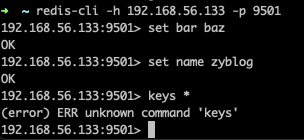
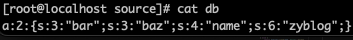
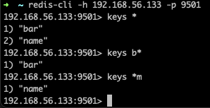

# Redis 服务器

Redis 服务端可不是我们说的去连接 Reids 服务器的那个东西，那个叫做 PHP 的 Reids 客户端。服务端的意思是一个可以提供服务的应用，redis-server 才是我们最熟悉的那个 Redis 的服务端。

那么在 Swoole 中，这个 Redis 服务端是个什么东西呢？其实它是一个基于 Redis 协议的服务器程序，可以让我们使用 Redis 的客户端来连接这个服务。光这么说估计大家还是一脸蒙圈，我们直接来看看效果再说。

## 服务端

```php
use Swoole\Redis\Server;

define('DB_FILE', __DIR__ . '/db');

$server = new Server("0.0.0.0", 9501, SWOOLE_BASE);

if (is_file(DB_FILE)) {
    $server->data = unserialize(file_get_contents(DB_FILE));
} else {
    $server->data = array();
}

$server->setHandler('GET', function ($fd, $data) use ($server) {
    if (count($data) == 0) {
        return $server->send($fd, Server::format(Server::ERROR, "ERR wrong number of arguments for 'GET' command"));
    }

    $key = $data[0];
    if (empty($server->data[$key])) {
        return $server->send($fd, Server::format(Server::NIL));
    } else {
        return $server->send($fd, Server::format(Server::STRING, $server->data[$key]));
    }
});

$server->setHandler('SET', function ($fd, $data) use ($server) {
    if (count($data) < 2) {
        return $server->send($fd, Server::format(Server::ERROR, "ERR wrong number of arguments for 'SET' command"));
    }

    $key = $data[0];
    $server->data[$key] = $data[1];
    return $server->send($fd, Server::format(Server::STATUS, "OK"));
});

$server->setHandler('sAdd', function ($fd, $data) use ($server) {
    if (count($data) < 2) {
        return $server->send($fd, Server::format(Server::ERROR, "ERR wrong number of arguments for 'sAdd' command"));
    }

    $key = $data[0];
    if (!isset($server->data[$key])) {
        $array[$key] = array();
    }

    $count = 0;
    for ($i = 1; $i < count($data); $i++) {
        $value = $data[$i];
        if (!isset($server->data[$key][$value])) {
            $server->data[$key][$value] = 1;
            $count++;
        }
    }

    return $server->send($fd, Server::format(Server::INT, $count));
});

$server->setHandler('sMembers', function ($fd, $data) use ($server) {
    if (count($data) < 1) {
        return $server->send($fd, Server::format(Server::ERROR, "ERR wrong number of arguments for 'sMembers' command"));
    }
    $key = $data[0];
    if (!isset($server->data[$key])) {
        return $server->send($fd, Server::format(Server::NIL));
    }
    return $server->send($fd, Server::format(Server::SET, array_keys($server->data[$key])));
});

$server->setHandler('hSet', function ($fd, $data) use ($server) {
    if (count($data) < 3) {
        return $server->send($fd, Server::format(Server::ERROR, "ERR wrong number of arguments for 'hSet' command"));
    }

    $key = $data[0];
    if (!isset($server->data[$key])) {
        $array[$key] = array();
    }
    $field = $data[1];
    $value = $data[2];
    $count = !isset($server->data[$key][$field]) ? 1 : 0;
    $server->data[$key][$field] = $value;
    return $server->send($fd, Server::format(Server::INT, $count));
});

$server->setHandler('hGetAll', function ($fd, $data) use ($server) {
    if (count($data) < 1) {
        return $server->send($fd, Server::format(Server::ERROR, "ERR wrong number of arguments for 'hGetAll' command"));
    }
    $key = $data[0];
    if (!isset($server->data[$key])) {
        return $server->send($fd, Server::format(Server::NIL));
    }
    return $server->send($fd, Server::format(Server::MAP, $server->data[$key]));
});

$server->on('WorkerStart', function ($server) {
    $server->tick(10000, function () use ($server) {
        file_put_contents(DB_FILE, serialize($server->data));
    });
});

$server->start();
```

查看上面的代码，我们会发现这也是一个 Server 对象。然后主要是使用 setHandler() 方法来监听 Reids 命令，在这里我们看到了熟悉的 get、set 等命令的定义。然后我们指定了 $server->data ，可以将它看成是一个数据源，直接使用的就是一个文件，直接在当前测试环境目录下创建一个叫做 db 的空文件就可以了。

在 setHandler() 方法中，我们使用 send() 方法来返回响应的命令信息，并通过 format() 方法格式化返回的响应数据。

最后，通过一个监听一个 WorkerStart 事件，来设置了一个每隔一秒将数据写入到 db 文件的操作。

## 客户端测试

现在，运行起来这个文件吧，然后使用你的 redis-cli 来连接并测试它。



神奇吗？惊喜吗？我们竟然实现了一个 Redis 服务器，再看看 db 文件中是什么内容。



不出所料，db 中保存的是我们序列化之后的内容。这个东西是不是很有意思，完全可以做一个我们自己的小 Redis 来用。对于一些小网站，小应用来说，你不需要再去安装一个庞大的 Redis 服务了，直接使用 Swoole 就可以实现一个遵循 Redis 协议规范的小型缓存服务器了。

## 添加一个命令

话说回来，注意到上面测试的截图中我们使用了 keys 命令却返回了一个 unknow command 吗？因为在这里，所有的命令我们都要在 setHandler() 中一个一个的定义。相对来说，这东西写起来的还是比较麻烦的。最后，我们再来简单地实现一个 keys 命令好了。

```php
$server->setHandler('KEYS', function ($fd, $data) use ($server) {
    if (count($data) == 0) {
        return $server->send($fd, Server::format(Server::ERROR, "ERR wrong number of arguments for 'GET' command"));
    }

    if(!$server->data){
        return $server->send($fd, Server::format(Server::NIL));
    }

    $key = $data[0];
    if($key == "*"){
        return $server->send($fd, Server::format(Server::SET, array_keys($server->data)));
    }else{
        $dataKeys = array_keys($server->data);
        $key = str_replace(["*", "?"], [".*", ".?"], $key);
        $values = array_filter($dataKeys, function($value) use ($key){
            return preg_match('/'.$key.'/i', $value, $mchs);
        });
        if($values){
            return $server->send($fd, Server::format(Server::SET, $values));
        }
    }
    return $server->send($fd, Server::format(Server::NIL));
});
```

并不是很规范，但功能是没问题的，大家可以测试一下效果。



## 总结

关于 Redis 服务器这一块的内容，我们了解一下就好了，实际的使用中自己去写这些东西还是挺费劲的。到这里为止，我们的入门相关课程就学习完了。

大家还记得讲了什么吗？就是简单地搭起了 Http/TCP/UDP/WebSocket/Redis 这几个服务。通过这几个服务，我们日常的 Web 应用其实就已经全部都可以覆盖了。只是说，我们都是使用的原生的 Swoole 对象及函数来实现的非常简单的测试代码。真正在实际的项目中使用的话，一般还是会借助框架来实现。

那么我们就继续进阶方面的内容，到最后才会简单地学习了解一个 Swoole 框架。别急，基础才是王道嘛！

测试代码：

参考文档：

[https://wiki.swoole.com/#/redis_server](https://wiki.swoole.com/#/redis_server)