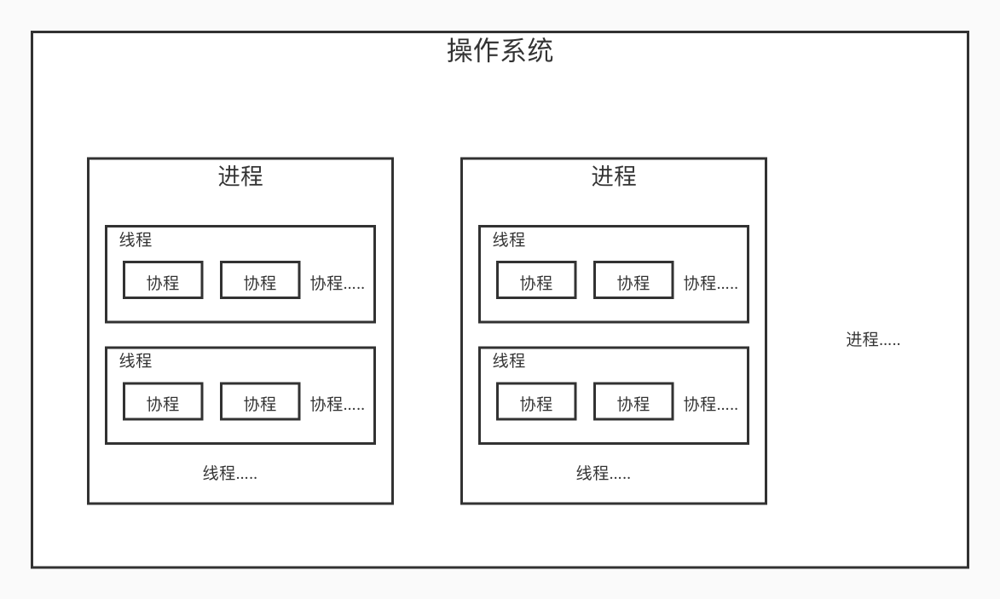

# 进程、线程、协程，面试你被问了吗？

总算开始了，大家最关心的问题，也是我们面试经常会遇到的问题。相信不少同学都会经历过面试官提出的这个问题。如果你的本专业就是计算机相关的专业，那么这个问题非常简单，但如果你不是的话，那么还真是要补补课呢。

进程相关的问题，在计算机专业中一般是操作系统中来进行讲解的。不过之前包括在数据结构相关的课程中我也说过，我并不是计算机专业的，所以说，这个问题对于之前的我来说还真是挺懵圈的。通过这些年来学习了一些操作系统相关的知识，有了一些了解，并且确实真的是仅限于了解的水平，也没有特别深入的学习和实验，所以今天的内容中的各种纰漏也请大家多多指正。

## 进程

进程，最简单的理解就是我们运行起来的软件。它是一段程序的执行过程。比如说，你在 Windows 上打开了 QQ ，然后去任务管理器就可以看到一个 QQ.exe 的程序正在执行。这个东西就叫做进程。

进程有开始有结束，我们关了 QQ ，自然 QQ 对应的进程也就结束了。而对于服务器操作系统来说，我们的服务应用程序一般是不会进行重启的，但它确实也有结束的可能。比如说升级服务器，修改配置文件等等。

多开几个 QQ ，或者就像当年我们玩游戏时多开游戏，其实就是多进程的应用。另外，进程还有子进程这一概念，它是调用操作系统的 fork() 函数创建的，一般这样的子进程是父进程的一个复制品。Swoole 的核心高并发实现其实正是基于这种多子进程的形式的，后面我们会详说。

对于 CPU 来说，它会使用轮询或者其它的调度算法不停地以时间片的方式执行不同的进程，所以不同的进程会互相切换。假如说你听着歌，看着网页，写着代码，看似同时在进行，其实 CPU 在底层是在不断地切换执行这些进程的，只是速度太快你感觉不到而已。操作系统则主要是负责这些进程的管理、调度、切换。

当你使用 PHP 命令行执行某个 php 文件时，其实也和打开 QQ 的操作一样启动了一个 PHP 进程，或者说就是运行起了一个 PHP 程序。这时在 ps -ef 或者 top 命令中，就可以看到你运行起来的程序信息。进程会在执行过程中会占用 CPU 和 内存 等资源，根据程序的操作不同，也可能会产生网络IO、硬盘IO，这一切，都是通过操作系统来进行调度的。传说中的优化也是针对这些资源的利用率进行优化。

传统的 PHP-FPM 是多进程形式的，它本身的意思就是 FastCGI 进程管理器。Nginx 其实也是多进程的，当同一个进程中的程序如果有耗时操作，会产生阻塞，Nginx 就会进行等待，因此，当请求量非常大的时候，PHP-FPM 就会非常累。同时，PHP 是我们之前说过的动态语言，加载过程是完全的整体加载，这样也会带来性能的损耗。传统 PHP 抗不了高并发，或者说高并发性能很差的原因也就在这里了。

虽说有问题，但是进程是一个程序的开始，如果你做过 C 或 Java 的开始，一定知道有个 main() 方法很重要。其实，在 PHP 中，一样存在这个 main() 方法，只是是在底层的 C 中，我们看不到而已。没有进程，程序就不存在，这是基础，是后面线程和协程的根本。

多进程操作其实就是充分利用多核 CPU 的优势，一个 CPU 去对应一个进程的操作，从而提高进程的执行效率。比如我们在 Swoole 中可以设置 worker_num ，它的建议设置值就是根据 CPU 的核数。同样地，Nginx 配置中的 worker_processes 也是建议配置成 CPU 的核数。

## 线程

线程，是操作系统能够进行运算调度的最小单位。它被包含在进程之中，是进程中的实际运作单位。一条线程指的是进程中一个单一顺序的控制流，一个进程中可以并发多个线程，每条线程并行执行不同的任务。

这么说吧，进程是个包工头，线程是它手下的工人。如果只有一个包工头，又要铺地板，又要刷墙，只能一步一步地顺序地来。如果其中一个出现问题了，后面的工作就要等着前面的工作完成，这种情况的操作过程就叫做 串行 操作。这个时候，包工头雇佣了两个工人，让他们同时干活，一个铺地板，一个刷墙，是不是一我们的工程速度一下就提高了很多，这种情况就叫做 并行 操作。

再来概括一下，线程就是进程的小弟，并且可以在一个进程中同步地执行一些并行操作，一些复杂的 IO 操作、容易被阻塞的业务都可以放到线程中进行。想想也知道，我们的程序执行效率将会有一个质的飞跃。但是，线程也不是相像中的那么美好，线程之间会竞争资源，特别是对于同一个资源。比如说我们要操作一个文件，两个线程并行同时访问修改，那就很容易出问题。这个问题其实就是非常类似于我们 MySQL 中的事务问题。MySQL 是怎么解决的？用锁，用事务隔离级别。同样地，在应用程序中，我们也可以加锁。就像 Java 中的 synchronized 同步锁。当加了同步锁之后，访问这个锁相关内容的线程将被阻塞，前面的释放了后面的才能进来执行。

线程之间是互相独立的，但是它们可以共享进程的资源，而多个进程之间是没办法做到资源共享的，只能借助外部力量或进程间通信。其实这个也很好理解，线程是进程的小弟嘛，同一个进程里面的线程都可以获得大哥的信息。同时，线程也是会消耗系统资源的，线程开得太多就和进程开得太多一样，让 CPU 、内存 等资源非常嗨。

线程的英文名是 Thread ，在 Java 中，直接就可以实例化这样一个名字的对象来执行线程操作。但在 PHP 中，估计你就真没见过了。其实，在 PHP 中，本身也有一个 pthreads 扩展，在这个扩展里面就有一个 Thread 类可以使用。但是，pthreads 扩展已经停止维护了。在 PHP7.2 之后有一个 parallel 扩展可以替代 pthreads 扩展。关于这个扩展我们以后有机会再详细说吧，毕竟没啥现成的资料，而且文档还全是英文的。

在 Swoole 中，其实我们是创建不了线程的。Swoole 中默认会有一系列的线程能力，但是是用在底层处理网络 IO 等相关操作。包括我们之前讲过的异步任务，其实它也只是子进程和异步IO进程的应用，不是线程。在 Swoole 中，我们使用的更多的其实是下面要讲到的 协程 。

## 协程

协程，从官方意义上来说，不是进程也不是线程，它更类似于一个不带返回值的函数调用。但是，如果通俗一点说，你把它想象成线程也问题不大，只不过这个线程是用户态的。什么意思呢？进程和线程是系统来控制的，包括切换调度，而协程是可以自己操作的，不需要操作系统参与，创建销毁的成本非常低。但同时，它又不像多线程可以充分利用 CPU 。在 Swoole 中，我们在协程中需要借助于多进程模型来利用到多核 CPU 的优势。

话说回来，协程就是个更轻量级的线程，或者再进一步说协程是线程的小弟。线程进程开得越多，资源占用得越多，操作系统为之带来的切换消耗也越多。而协程则是运行在线程之上，当一个协程运行完成之后，主动让出，让另一个协程运行在当前线程之上，减少了线程的切换。同理，我们也就不需要再开那么多的线程了。注意，这里的协程是 并发 ，不是上面线程中说的 并行 。并行是真的可以在同一时间一起运行，而并发则是一起启动，但还是依靠 CPU 快速切换来执行，本质上还是串行，只是看起来像是同时在执行。对于 并行 和 并发 不太了解的小伙伴可以再详细查阅下相关资料哦。

打个比方，原来我们需要开 1 个进程，100 个线程，现在使用协程，我们可以开 1 个进程，100 个线程，然后每个线程之上再运行 100 个协程。现在，你相当于有 10000 个处理事务的小弟在工作，过不过瘾。最主要的是，机器配置还不用变，并发同步处理从 100 变成了 10000 。

当然，并不是说协程就无敌了。协程只有在等待 IO 的过程中才能重复利用线程。一条线程在等待耗时的 IO 操作时会阻塞，其实操作系统这个时候认识的只有线程，当它阻塞了，这个线程里面的协程也是在阻塞态的。如果没有异步调用的支持，其实协程也发挥不了什么作用。异步调用又是个啥？就是 异步IO ，epoll 有了解过不？或者说，JavaScript 中的事件循环。

既然是循环，其实想必你也清楚了，我们来总结一下。协程只是说在一个线程中，通过自己控制自己，来让一个线程中可以执行多个协程程序，当前面的协程阻塞时，通过异步 IO 放在那里去执行，然后切换到其它的协程运行。在这个时候，操作系统并不需要切换或者创新新的线程，减少了线程的切换时间。注意，真正并行的只有线程，或者两个不相干的进程，而协程，并不是并行处理的，在线程中，它也是在 CPU 的时间分片机制下的切换执行。一个线程中的一个协程运行时，其它的协程是挂起状态的。它的切换成本非常低，而且是用户态可控的。协程和进程、线程完全不是一个维度的概念，就像上面说的，它就是个函数。

现在协程是比较流行的开发趋势，特别是 Go 语言这种天生支持协程的语言大火也是有它的原因的。Swoole 其实也从很早就开始支持协程了，并且最主要是的，使用协程开发我们的代码还是可以使用原来的传统方式来写，极大地方便了我们的业务迁移。这些我们在后面都会接触到。

## 三程特点

我们来总结一下这三个程的特点。一个一个来说。

### 进程

- 就是我们执行的程序。程序和程序之间没有共享内容，都是自己独立的内存空间。

- 调度切换由操作系统完成，用户无感知，切换内容非常多，开销大，效率低。

- 需要通信的话一般是通过信号传递，或者外部工具。

### 线程

- 进程下面的小弟，同一个进程间的多个线程共享内存。

- 真正的并行执行，可以利用 CPU 的核数。

- 调度切换比进程小，但一样是操作系统完成，开销和效率中等。

### 协程

- 线程的小弟，但其实更像是一个函数。

- 在线程之上的串行运行，依赖于线程，而且依赖于异步 IO ，如果没有 异步IO 的支持，它和线程没什么区别。

- 更加轻量级，用户态切换，开销成本低，效率非常高。

## 总结

今天全是概念性的内容，参考的资料也非常多，这里就不一一列举了，反正就是百度来的，另外还包含一些我之前学过的 哈工大 操作系统 李治军 教授的这门慕课上的一些笔记。大家可以去学习一下哦，中国大学慕课上很多好的资源。之前我也一直说过，操作系统、数据结构、网络、设计模式 四大件是我们程序员的四大法宝，不说成为大神，但至少要都了解到。否则，你的进步会很慢，也很有限。

另外，就像开头所说，本人水平有限，有任何不对的地方，也请各位大佬留言指正，修改后的内容也会随时重新发布到我的博客上，需要最新资料的可以去博客上看，确实有更新的，微信也会在留言处进行订正，以免误人子弟。
