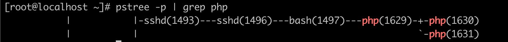
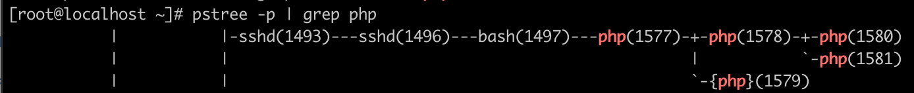
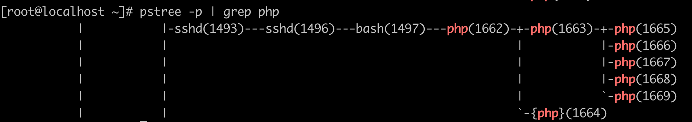
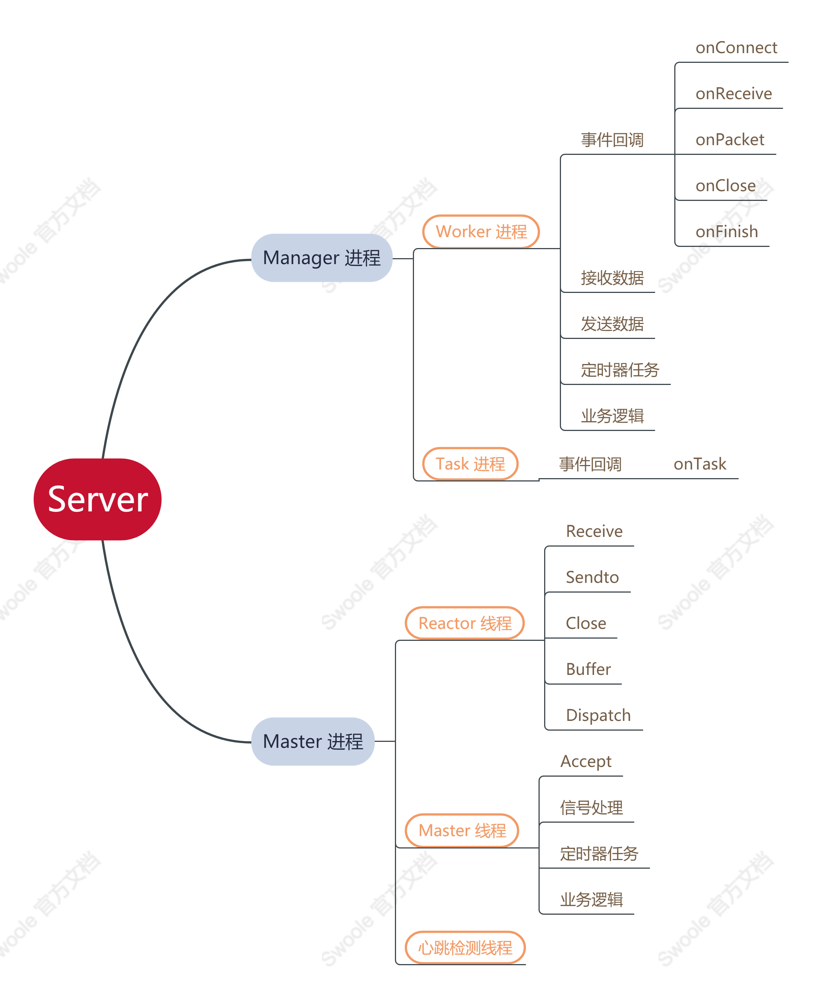
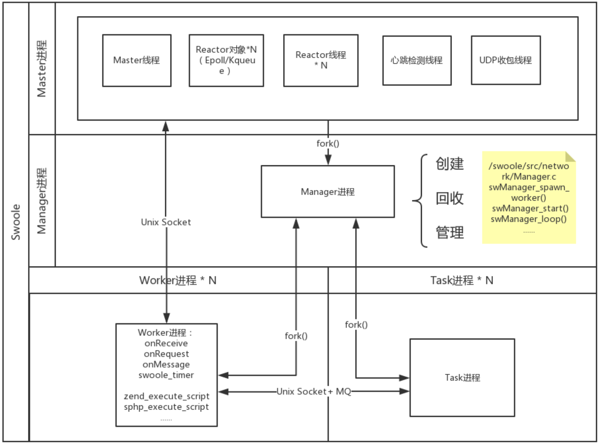
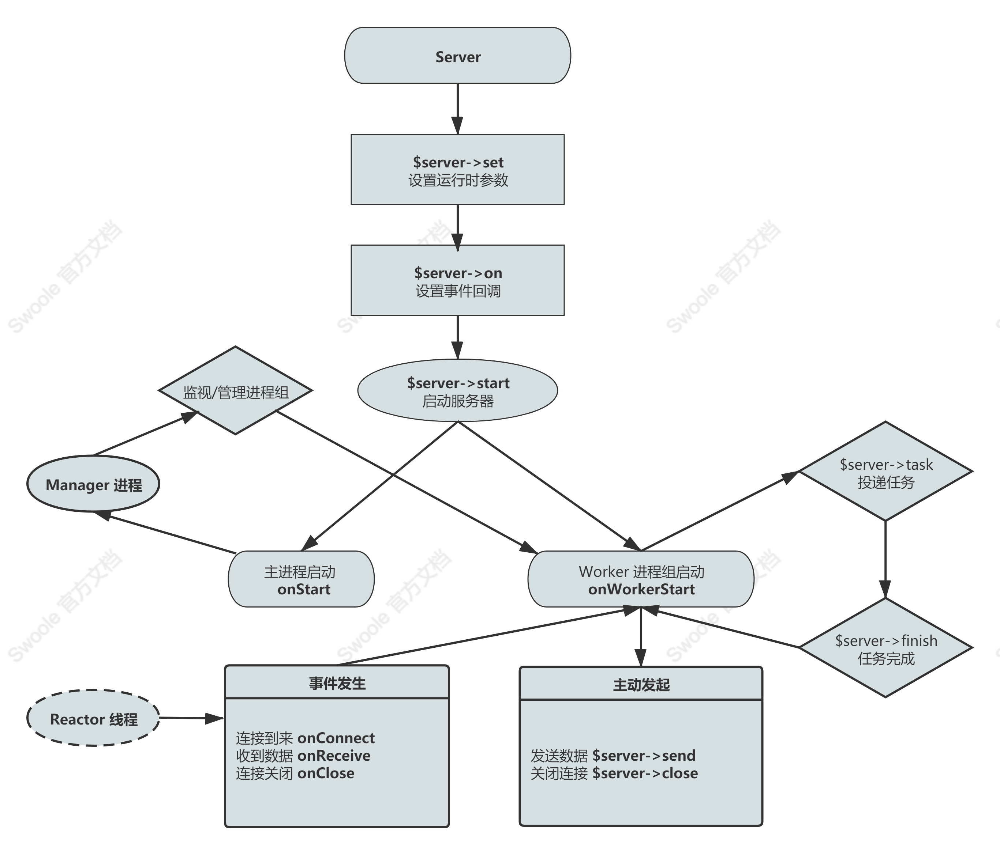

# Swoole 异步进程服务系统

在了解了整个进程、线程、协程相关的知识后，我们再来看看在 Swoole 中是如何处理通过异步方式处理进程问题的，并且了解一下线程在 Swoole 中的作用。

## Server两种运行模式

其实在之前的测试代码中，我们就已经见到过这两种模式了，只是当时没说而已。不管是 Http 还是 TCP 等服务中，我们都有第三个参数的存在，默认情况下，它会赋值为一个 SWOOLE_PROCESS 参数，因此，如果是默认情况下我们一般不会写这个参数。而另外一种模式就是 SWOOLE_BASE 。

### SWOOLE_BASE模式

这种模式就是传统的异步非阻塞模式，它的效果和 Nginx 以及 Node.js 是完全一样的。在 Node.js 中，是通过一个主线线程来处理所有的请求，然后对 I/O 操作进行异步线程处理，避免创建、销毁线程以及线程切换的消耗。当 I/O 任务完成后，通过观察者执行指定的回调函数，并把这个完成的事件放到事件队列的尾部，等待事件循环。

这个东西吧，要讲清楚，开一个大系列都不为过。但是如果你之前学习过一点 Node 的话，那么其实就很好理解。因为我们之前写的各种 Server 服务代码，其实和 Node 中写得基本完全一样。都是一个事件，然后监听成功后在回调函数中写业务代码。这就是通过回调机制来实现的异步非阻塞模式，将耗时操作放在回调函数中。有兴趣的同学可以去简单地学习一下 Node.js ，只要有 JS 基础，一两看看完一套入门教程就可以了。

在 Swoole 的 SWOOLE_BASE 模式下，原理也是完全一样的。当一个请求进来的时候，所有的 Worker 都会争抢这一个连接，并最终会有一个 Worker 进程成功直接和客户端建立连接，之后这个连接中所有的数据收发直接和这个 Worker 通讯，不再经过主进程的 Reactor 线程转发。

### SWOOLE_PROCESS模式

SWOOLE_PROCESS 的所有客户端都是和主进程建立的，内部实现比较复杂，用了大量的进程间通信、进程管理机制。适合业务逻辑非常复杂的场景，因为它可以方便地进行进程间的互相通信。

在 SWOOLE_PROCESS 中，所有的 Worker 不会去争抢连接，也不会让某一个连接与某个固定的 Worker 通讯，而是通过一个主进程进行连接。剩下的事件处理则交给不同的 Worker 去执行，当到达 Worker 之后，同样地也是使用回调方式进行处理了，后续内容基本就和 BASE 差不多了。也就是说，Worker 功能的不同是它和 SWOOLE_BASE 最大的差异，它实现了连接与数据请求的分离，不会因为某些连接数据量大某些量小导致 Worker 进程不均衡。具体的方式就是在这种模式下，会多出来一个主管线程的进程，其中还会有一个非常重要的 Reactor 线程，下面我们再详细说明。

### 两种模式的异同与优缺点

如果客户端之间不需要交互，也就是我们普通的 HTTP 服务的话，SWOOLE_BASE 模式是一个很好的选择，但是它除了 send() 和 close() 方法之外，不支持跨进程执行。但其实，这两种模式在底层的处理上没什么太大的区别，都是走的异步IO机制。只是说它们的连接方式不同。SWOOLE_BASE 的每个 Worker 都可以看成是 SWOOLE_PROCESS 的 Reactor 线程和 Worker 进程两部分的组合。

我们可以来测试一下。

```php
$http = new Swoole\Http\Server('0.0.0.0', 9501, SWOOLE_BASE);

//$http = new Swoole\Http\Server('0.0.0.0', 9501, SWOOLE_PROCESS);

$http->set([
    'worker_num'=>2
]);

$http->on('Request', function ($request, $response) {
    var_dump(func_get_args());
    $response->end('开始测试');
});

$http->start();
```

通过切换上面两个注释，我们就可以查看两种服务运行模式的情况，可以通过 pstree -p 命令。

在 SWOOLE_BASE 模式下，输出的内容是这样的。



可以看到，在 1629 这个进程下面有两个子进程 1630 和 1631 。然后切换成 SWOOLE_PROCESS 模式，再查看进程情况。



很明显，这里不一样了，在 1577 这个 Master 主进程下，有两个进程，一个是 1578 ，一个是 1579 它表示的是线程组，然后在 1578 Manager 管理进程下面，又有 1580 和 1581 两个 Worker 进程。

同样地，我们使用之前在 【Swoole教程2.5】异步任务[]() 中的代码来测试，可以看到 Task 异步任务也是起的进程。（注意，我们在测试代码中设置的是 task_worker_num，没有设置 worker_num ，所以是 1个Worker + 4个 TaskWorker 进程，最后再加一个 PROCESS 模式的 线程组 ）如果如图所示。



到这里，相信你也看出了，SWOOLE_BASE 比 SWOOLE_PROCESS 少了一层进程的递进，也就是少了一个层级。在 SWOOLE_BASE 模式下，没有 Master 进程，只有一个 Manager 进程，另外就是没有从 Master 中分出来的线程组。关于 Master/Manager/Reactor/TaskWorker 这些东西我们下一小节就会说到。

BASE 模式因为更简单，所以不容易出错，它也没有 IPC 开销，而 PROCESS 模式有 2 次 IPC 开销，master 进程与 worker 进程需要 Unix Socket 进行通信。IPC 这东西就是同一台主机上两个进程间通信的简称。它一般有两种形式，一个是通过 Unix Socket 的方式，就是我们最常见的类似于 php-fcgi.sock 或者 mysql.sock 那种东西。另一种就是 sysvmsg 形式，这是 Linux 提供的一种消息队列，一般使用的比较少。

当然，BASE 模式也有它自身存在的问题，主要也是因为上面讲过的特性。由于 Worker 是和连接绑定的，因此，某个 Worker 挂掉的话，这个 Worker 里面的所有连接都会被关闭。另外由于争抢的情况，Worker 进程无法实现均衡，有可能有些连接数据量小，负载也会非常低。最后，如果回调函数中阻塞操作，会导致 Server 退化为同步模式，容易导致 TCP 的 backlog 队列塞满。不过就像上面说过的，Http 这种无状态的不需要交互的连接，使用 BASE 没什么问题，而且效率也是非常 OK 的。当然，既然默认情况下 Swoole 已经为我们提供的是 SWOOLE_PROCESS 进程了，那么也就说明 SWOOLE_PROCESS 模式是更加推荐的一种模式。

## 各种进程问题

接下来，我们继续学习上面经常会提到的各种进程和线程问题。

### Master 进程

它是一个多线程进程。用于管理线程，它会创建 Master 线程以及 Reactor 线程，并且还有心跳检测线程、UDP 收包线程等等。

### Reactor 线程

这个线程我们不止一次提到了，它是在 Master 进程中创建的，负责客户端 TCP 连接、处理网络 IO 、处理协议、收发数据，它不执行任何 PHP 代码，用于将 TCP 客户端发来的数据缓冲、拼接、拆分成完整的一个请求数据包。我们在 Swoole 代码中操作不了线程，为什么呢？其实 PHP 本身就是不支持多线程的，Swoole 是一种多进程应用框架。在这里的线程是在底层用 C/C++ 封装好的。因此，也并没有为我们提供可以直接操作线程的接口。但我们已经学习过了，协程本身就是工作在线程之上的，而且，协程也已经是现在的主流方向了，所以在 Swoole 中，进程管理和协程，才是我们学习的重点。

### Worker 进程

Worker 是授受 Reactor 线程投递过来的请求数据包，并执行具体的 PHP 回调函数来进行数据处理的。在处理完成之后，将生成的响应数据发送回 Reactor 线程，再由 Reactor 发送给客户端。Worker 进程可以是异步非阻塞模式的，也可以是同步阻塞模式的，并且是以多进程方式运行的。

### TaskWorker 进程

它是接受收 Worker 进程投递过来的任务，处理任务后将结果返回给 Worker 进程，这种模式是同步阻塞的模式，同样它也是以多进程的方式运行的。

### Manager 进程

这个进程主要负责创建、回收 Worker/TaskWorkder 进程。其实就是一个进程管理器。

### 它们的关系

首先，我们先来看两张图，也是官网给出的图，并根据这两张图再来看看官网给出的例子。



第一张图主要是 Manager 和 Master 的功能。我们主要看第二张图。



在这张图中，我们可以看到，Manager 进程创建、回收、管理最下面的 Worker 进程和 Task 进程。并且是通过操作系统的 fork() 函数创建的，这个东西如果学过操作系统的同学应该不会陌生，它就是创建子进程的函数。子进程间通过 Unix Socket 或者 MQ 队列进行通信。如果你是 BASE 模式，那么就不会有 Master 进程，这个时候，每一个 Worker 进程自己会承担起 Reactor 的功能，接收、响应请求数据。

如果你是使用的 PROCESS 模式，那么上面的 Master 进程就会创建各种线程，还记得那个大括号的线程组吧，这个可是 BASE 模式没有的。它用于处理请求响应问题，不用想，多线程方式对于连接请求来说效率会更高。这也是前面说过的两种模式的优缺点的具体体现。然后 Reactor 线程通过 Unix Socket 与 Worker 进行通讯，完成数据向 Worker 的转发与接收。

我们用官网给出的例子来再说明一下它们之间的关系。Reactor 就是 nginx，Worker 就是 PHP-FPM 。Reactor 线程异步并行地处理网络请求，然后再转发给 Worker 进程中去处理。Reactor 和 Worker 间通过 Unix Socket 进行通信。

在 PHP-FPM 的应用中，经常会将一个任务异步投递到 Redis 等队列中，并在后台启动一些 PHP 进程异步地处理这些任务。这个场景相信大家都不会陌生吧，比如说我们下了订单之后，在原生 PHP 环境下进行消息通知、邮件发送，我们都会直接将这种问题放到一个队列中，然后让后台跑起一个脚本去消费这些队列从而进行信息发送。而 Swoole 提供的 TaskWorker 则是一套更完整的方案，将任务的投递、队列、PHP 任务处理进程管理合为一体。通过底层提供的 API 可以非常简单地实现异步任务的处理。另外 TaskWorker 还可以在任务执行完成后，再返回一个结果反馈到 Worker。

一个更通俗的比喻，假设 Server 就是一个工厂，那 Reactor 就是销售，接受客户订单。而 Worker 就是工人，当销售接到订单后，Worker 去工作生产出客户要的东西。而 TaskWorker 可以理解为行政人员，可以帮助 Worker 干些杂事，让 Worker 专心工作。

上述内容需要好好理解，特别是对于我们些长年接触传统的 PHP-FPM 模式开发的同学来说，要转换思维很不容易。不过根据官方提供的例子，相信大家也能很快把这个弯转过来。普通的请求就是把我们的 Nginx+PHP-FPM 给结合起来了，而 Task 则是可以处理一些类似于消息队列的异步操作。

## Swoole 服务运行流程

最后，我们再来了解一下整体 Swoole 服务的运行流程，同样也是来自官网的图片。



其实这个流程图和我们的代码流程非常类似。定义一个 Server 对象，使用 set() 方法设置参数，然后使用 on() 方法开始监听各种回调，最后 start() 方法启动服务。在服务启动之后，创建了 Manager 进程，如果是 PROCESS 模式的话，则是先创建一个 Master 进程，然后在 Master 之下创建 Manager 。接着，Manager 根据 tasker_num 数量创建并管理相对应数量的 Worker 进程。其中，可以在 Worker 中创建异步的 task 进程。

Reactor 线程在最外面处理请求响应问题，监听相对应的事件，并与 Worker 进行通信。如果是 BASE 模式，不存在 Reactor 线程，则是全部由 Worker 来解决，而且它与连接的关系是一对一的。

## 总结

又是让人晕头转向的一篇文章吧。在今天的学习中，最主要的其实还是一种思维的转变，那就是我们要通过多进程的方式来提供服务应用。而且这种模式其实并不陌生，Nginx+PHP-FPM 就是这种模式，只不过，PHP-FPM 本身就是一个进程管理工具，但它的效率以及实现方式都与 Swoole 略有差别。包括在 PHP8 之后的 JIT ，它就是通过 OPCahce 来实现的，也是在将大部分代码全部一次加载到内存中，就像 Swoole 一样节约每次 PHP-FPM 的全量加载问题从而提升性能。

好好消化吸收一下吧，不过同样的，如果上述内容有错误纰漏，随时欢迎大家指正批评，毕竟水平有限。

测试代码：

参考文档：

[https://wiki.swoole.com/#/server/init](https://wiki.swoole.com/#/server/init)

[https://wiki.swoole.com/#/learn?id=process-diff](https://wiki.swoole.com/#/learn?id=process-diff)