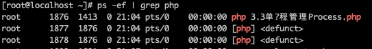
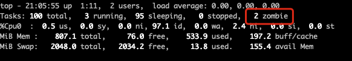

# 单进程管理Process

既然我们的服务应用已经提供了多进程的运行模式，那么我们可以直接自己来操作进程吗？答案当然是没问题的。今天我们来看到的就是在 Swoole 中如何操作单个进程，其实也就是学习一个 Process 对象的使用。

## 一个例子

要使用 Swoole 的多进程能力非常简单，直接实例化 Process 对象即可。

```php
for ($i = 0; $i < 2; $i++) {
    $process = new \Swoole\Process(function () {
        $t = rand(10, 20);
        echo 'Child Process #' . getmypid() . 'start and sleep ' . $t . 's', PHP_EOL;
        sleep($t);
        echo 'Child Process #' . getmypid() . ' exit', PHP_EOL;
    });
    $process->start();
}
```

这样我们就创建了两个子进程，在回调函数中，可以获取到进程的 ID 信息。在这段测试代码里面，让两个子进程工作的时候休息几秒。当运行这段代码的时候，如果你用 ps 去查看进程的话，一般只能看到两个进程，并且它们的父进程都是 1 。其实，我们当前的这个执行起来的进程已经结束了，剩下两个在 sleep() 阻塞中的进程由于主进程的退出已经交由系统接管上升成为两个主进程了。但不管怎么说，起码多个进程我们是启动起来了。

当然，现在的效果不是我们想要的，毕竟我们需要的是一个主进程运行，多个子进程进行任务处理。别急，我们继续看。


## 僵尸进程与回收

由于父子进程是一个异步过程，就像上面的示例一样，父进程退出了子进程依旧还是在执行。但我们通常在应用多子进程的时候，都会启动一个挂起的父进程，然后通过子进程来工作，实现并行处理的能力。其实就像我们的 Manager 和 Worker 的感觉。然而，子进程结束了父进程并不知情呀，它们是异步方式活动的。这个时候，如果没有回收机制的话，之前创建的子进程就会成为僵尸进程。

关于这方面的知识，大家可以看下操作系统相关的内容，特别是 Unix 相关的。我们先来模拟一下，在代码中加入下面一行，让主程序保持运行。

```php
while(1) sleep(100);
```

然后再次运行代码，等待子进程运行结束后，通过 ps 查看结果。



同时，使用 top 命令，我们也能看到有两个僵尸进程出现。



僵尸进程出现了，那么我们也需要一种方式来处理这些进程，大部分程序提供的都是 wait() 函数，Swoole 也不例外。但是，它会阻塞主进程，从名字意思就可以看出，它的作用是等待子进程执行完成。

```php
for ($n = 2; $n--;) {
    $status = \Swoole\Process::wait(true);
    echo "Recycled #{$status['pid']}, code={$status['code']}, signal={$status['signal']}" . PHP_EOL;
}
echo 'Parent #' . getmypid() . ' exit' . PHP_EOL;
//while(1) sleep(100);
```

即使我们去掉下面的挂起循环，最后的内容也会在两个子进程都结束执行之后才会输出出来。wait() 方法有一个参数，意思是设置为 false 的话以非阻塞状态等待回收。但这个时候你设置为 false 也是没用的，必须通过另外的方式来实现非阻塞回收。

```php
Swoole\Process::signal(SIGCHLD, function ($sig) {
    //必须为false，非阻塞模式
    while ($ret = Swoole\Process::wait(false)) {
        echo "PID={$ret['pid']}\n";
    }
});
echo 'Parent #' . getmypid() . ' exit' . PHP_EOL;
//while(1) sleep(100);
Swoole\Timer::tick(2000, function () {});
```

signal() 方法用于设置一个异步监听，SIGCHLD 是表示一个进程终止时，会将这个信号发送给主进程。我们在主进程监听到这个信息后，调用 wait() 方法去回收这个子进程，从而实现非阻塞方式的回收进程。同时，你也不能用 while + sleep() 来挂起程序了，因为 while 是同步阻塞的，我们需要使用 Swoole 中的一个定时器方法来实现异步挂起。现在你执行代码输出的结果应该是这个样子。

```
[root@localhost source]# php 3.3单进程管理Process.php
Child Process #2074start and sleep 19s
Child Process #2075start and sleep 16s
Child Process #2075 exit
PID=2075
Child Process #2074 exit
PID=2074
```

Parent 退出的那行文字被先输出了出来，其实也就是说，我们可以在主进程中再干别的事情了。

## 进程关系

对于子进程来说，它们是继承父进程的内存和文件句柄的。我们来看看是不是这样。

```php
$obj = new stdClass();
$obj->parent = 1;
var_dump($obj);

(new \Swoole\Process(function () use ($obj) {
    $obj->child1 = 1;
    var_dump($obj);
}))->start();

(new \Swoole\Process(function () use ($obj) {
    $obj->child2 = 1;
    var_dump($obj);
}))->start();
// [root@localhost source]# php 3.3单进程管理Process.php
// object(stdClass)#1 (1) {
// ["parent"]=>
//   int(1)
// }
// object(stdClass)#1 (2) {
// ["parent"]=>
//   int(1)
//   ["child1"]=>
//   int(1)
// }
// object(stdClass)#1 (2) {
// ["parent"]=>
//   int(1)
//   ["child2"]=>
//   int(1)
// }
```

同样是起了两个进程，可以看到在子进程中，打印出来的对象是包含父进程中的属性的。但是，两个子进程之间的对象不是共享的。从这里也可以看出，假如说你在父进程有一个 Redis 连接或者数据连接或者一个文件句柄，在子进程中都是可以使用的，它们是同一个连接对象或句柄。

## 其它操作方法

最主的概念相关性的东西讲完了，我们最后再看一些 Process 对象中的其它有意思的方法。

### 进程回调函数的参数

```php
(new \Swoole\Process(function () {
    var_dump(func_get_args());
}))->start();
//  [root@localhost source]# php 3.3单进程管理Process.php
//  array(1) {
//      [0]=>
//    object(Swoole\Process)#1 (6) {
//    ["pipe"]=>
//      int(4)
//      ["msgQueueId"]=>
//      NULL
//      ["msgQueueKey"]=>
//      NULL
//      ["pid"]=>
//      int(1956)
//      ["id"]=>
//      NULL
//     ["callback":"Swoole\Process":private]=>
//      object(Closure)#2 (0) {
//      }
//    }
//  }
```

进程的回调函数是有参数的哦，就是它自己这个进程 Proccess 对象本身。这个大家要知道，因为我们后面都会用到。

### 改名

使用 name() 方法可以给进程改名，改名是啥意思？往下看。

```php
(new \Swoole\Process(function (\Swoole\Process $process) {
    $process->name('Child Test1');
    sleep(10);
}))->start();

(new \Swoole\Process(function (\Swoole\Process $process) {
    $process->name('Child Test2');
    sleep(10);
}))->start();

swoole_set_process_name("Parent Test");

// [root@localhost ~]# ps -ef | grep Test
// root      1942  1413  0 21:45 pts/0    00:00:00 Parent Test
// root      1943  1942  0 21:45 pts/0    00:00:00 Child Test1
// root      1944  1942  0 21:45 pts/0    00:00:00 Child Test2
```

有意思吧，Process 对象的 name() 方法是 swoole_set_process_name() 这个全局函数的别名。所以我们在主进程使用的是 swoole_set_process_name() 演示的。如果是主进程，改名方法要在 start() 之后使用。如果是子进程，要在子进程的回调函数中使用。下面这样是无效的哦。

```php
$process = new \Swoole\Process(function () {
   sleep(10);
});
$process->start();
$process->name('Child Test3');
```

### 执行外部程序

```php
// php -r "echo 1+1;"
(new \Swoole\Process(function (\Swoole\Process $process) {
    echo $process->exec('/usr/local/php/bin/php', ['-r', 'echo 1+1;']);
    // 2
}))->start();
```

通过 exec() 函数，我们可以直接调用系统内部的其它程序。当然，前提是你要有权限。在这里，我们直接还是使用 php 命令行去进行一个简单的计算，其实就是执行了上面注释中的那个命令行语句。

### 守护进程

```php
Swoole\Process::daemon();
```

守护进程的概念也不用我多说了吧，最明显的就是我们的进程如果不是守护进程，那么在命令行运行起来的时候界面会一直保持在程序运行的状态中。而开启了守护进程之后，进程就转移到后台运行了，就像 nohup 的作用一样。

### exit 和 kill

```php
(new \Swoole\Process(function(\Swoole\Process $pro){
    $pro->exit(9);
    sleep(20);
}))->start();
//  Array
//  (
//      [pid] => 2086
//      [code] => 9
//      [signal] => 0
//  )
//  PID=2086

$process = new \Swoole\Process(function(\Swoole\Process $pro){
    sleep(20);
});
$process->start();
Swoole\Process::kill($process->pid);
//  Array
//  (
//      [pid] => 2087
//      [code] => 0
//      [signal] => 15
//  )
//  PID=2087

Swoole\Process::signal(SIGCHLD, function ($sig) {
    //必须为false，非阻塞模式
    while ($ret = Swoole\Process::wait(false)) {
        print_r($ret);
        echo "PID={$ret['pid']}\n";
    }
});
```

子进程自己退出可以使用 exit() ，主进程结束指定的子进程可以使用 kill ，这两个函数的信号码都可以在 wait() 中返回。

### 绑定CPU及进程优先级设置

```php
Swoole\Process::setAffinity([0,1]);

$process = new \Swoole\Process(function(\Swoole\Process $pro){
    echo $pro->getPriority(PRIO_PROCESS), PHP_EOL;
});
$process->start();
$process->setPriority(PRIO_PROCESS, -10);
```

setAffinity() 方法设置 CPU 的亲和性，也就是可以将进程绑定到特定的 CPU 核上。它的参数是从0开始的数据，比如4核的 CPU 可以使用的范围就是 0-3 。

setPriority() 函数用于设置进程的优先级，级别是从 -20 到 20 之间的数字，越小级别越高。而 getPriority() 则是获取当前进程的优先级。

## 总结

今天人内容比较多，我们主要是从 Process 对象出发，深入学习了在 Swoole 中如何操作进程。并且了解到了僵尸进程、继承父类这些问题，最后再看了一些 Process 对象的操作方法。相信通过今天的学习，我们都能够对进程有更多的了解。

除了今天学习的这些内容之外，Process 还有几个方法，我们放到下一篇和进程间通讯相关的内容一起学习。

测试代码：

参考文档：

[https://wiki.swoole.com/#/process/process](https://wiki.swoole.com/#/process/process)


