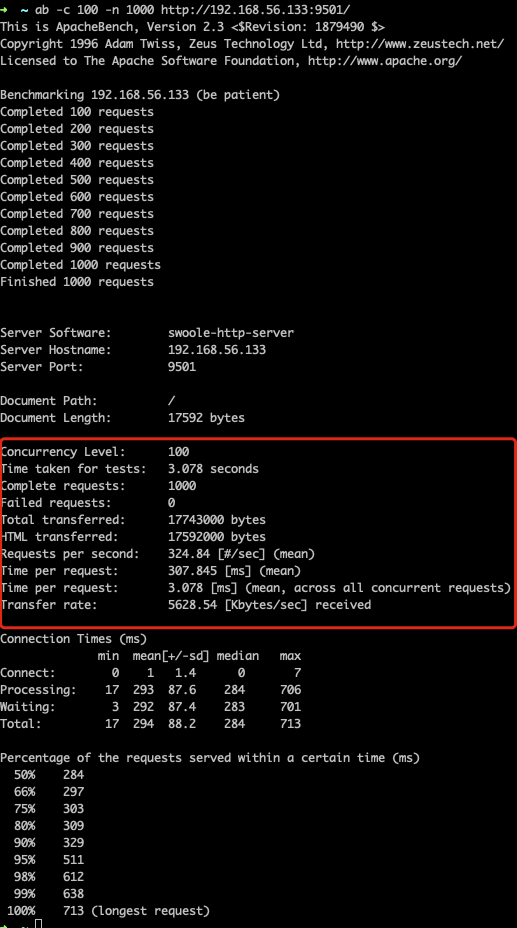

# 将Laravel改成Swoole版的

在讲正式的 Swoole 框架之前，我们先来试试自己把一个普通的 Laravel 框架看看能不能成功。当然，这只是一个实验性质的，其实我们还有很多别的选择。

## Laravel 的入口

首先，我们要知道 Laravel 的入口文件在哪里，要改造肯定也是要从入口来进行改造。一般情况下，我们会使用 public/index.php 这个文件做为整个框架程序的唯一入口。其实看它的代码，就是加载了 vendor/autoload.php ，然后使用 Composer 来开始管理框架依赖。接着通过引入 bootstrap/app.php ，来获得整个程序的应用对象。

如果你对 Laravel 还不太了解，可以看我们之前的 Laravel系列 文章和视频，公众号菜单上都有对应的链接。

既然是有一个单一入口，那么我们的改造主要也是针对这个单一入口进行的。下面我们就来试试。

## 新增一个启动文件

我们可以直接在 Laravel 的根目录创建一个 swoole_server.php 文件，然后把 public/index.php 中的代码复制过来，并把注释和一些没用的代码删了。就像下面这样。

```php
<?php

use Illuminate\Contracts\Http\Kernel;
use Illuminate\Http\Request;

define('LARAVEL_START', microtime(true));

require __DIR__.'/../vendor/autoload.php';

$app = require_once __DIR__.'/../bootstrap/app.php';

$kernel = $app->make(Kernel::class);

$response = $kernel->handle(
    $request = Request::capture()
)->send();

$kernel->terminate($request, $response);
```

然后呢？你还记得 Swoole 与传统 PHP 开发的不同吗？关注这些不同点就行了。

第一步，框架文件的加载是肯定的，而且应该是在主进程中就加载好的，不需要子进程或者协程再去重复加载。因此，上面的 require 都不太需要动。

第二步，我们要启动一个 HTTP 的 Swoole 服务，这个之前已经讲过很多次了，注意，在 onRequest 中，我们应该将 $kernel 相关的代码入进去。

```php
$http = new Swoole\Http\Server('0.0.0.0', 9501);

$http->on('Request', function ($req, $res) use($app) {
    try {
        $kernel = $app->make(Kernel::class);

        $response = $kernel->handle(
            $request = Request::capture()
        )->send();

        $kernel->terminate($request, $response);
    }catch(\Exception $e){
        print_r($e->getMessage());
    }
});
echo "服务启动", PHP_EOL;
$http->start();
```

这样就可以了吗？要不你先试试看。正常情况下可能你是获得不了任何的输入和输出的，这是为啥？

第三步，解决输入问题，其实就是超全局变量在 Swoole 中是不起作用的，所以 $_GET 之类的变量都会失效，Laravel 中 Request 相关的对象都无法获得数据了。这怎么办呢？我们从 onRequest 的参数中拿这些数据，然后再放回到当前进程协程中的 $_GET 中就好啦。

```php
$http->on('Request', function ($req, $res) use($app) {
    $_SERVER = [];
    if(isset($req->server)){
        foreach($req->server as $k => $v){
            $_SERVER[strtoupper($k)] = $v;
        }
    }
    $_GET = [];
    if(isset($req->get)){
        foreach ($req->get as $k => $v){
            $_GET[$k] = $v;
        }
    }
    $_POST = [];
    if(isset($req->post)){
        foreach ($req->post as $k => $v){
            $_POST[$k] = $v;
        }
    }
    try {
        $kernel = $app->make(Kernel::class);

        $response = $kernel->handle(
            $request = Request::capture()
        )->send();

        $kernel->terminate($request, $response);
    }catch(\Exception $e){
        print_r($e->getMessage());
    }
});
```

上面三段代码，分别解决了 $_SERVER、$_GET 和 $_POST 的问题。现在你再试试，参数是可以接收到了，但输入怎么是打印在控制台的？

第四步，解决输出问题，将框架中的所有输出放到输出缓冲区，然后再用 Swoole 的 Response 返回。

```php
$http->on('Request', function ($req, $res) use($app) {
    $_SERVER = [];
    if(isset($req->server)){
        foreach($req->server as $k => $v){
            $_SERVER[strtoupper($k)] = $v;
        }
    }
    $_GET = [];
    if(isset($req->get)){
        foreach ($req->get as $k => $v){
            $_GET[$k] = $v;
        }
    }
    $_POST = [];
    if(isset($req->post)){
        foreach ($req->post as $k => $v){
            $_POST[$k] = $v;
        }
    }
    //把返回放到一个缓冲区里
    ob_start();
    try {
        $kernel = $app->make(Kernel::class);

        $response = $kernel->handle(
            $request = Request::capture()
        )->send();

        $kernel->terminate($request, $response);
    }catch(\Exception $e){
        print_r($e->getMessage());
    }
    $ob = ob_get_contents();
    ob_end_clean();
    $res->end($ob);
});
```

最后的 ob_start() 这些内容，也是我们之前学习过的内容，也就不多做解释了。

至此，我们最简单的框架改造就完成了，赶紧试试效果吧。

## 试试协程效果

先定义一个路由。或者我们直接改造一下默认的路由。

```php
Route::get('/', function () {
    echo Swoole\Coroutine::getCid(), "<br/>";
    print_r(Swoole\Coroutine::stats());
    Swoole\Coroutine::sleep(10);
    echo "<br/>";
    echo getmypid(), "<br/>";
//    return view('welcome');
});
```

打印了一堆东西，不过应该都比较熟悉吧，前两个是协程 ID 和协程信息的输出，然后我们 Swoole\Coroutine::sleep() 了 10 秒，再打印一下进程 ID 。

然后我们打开浏览器，准备两个标签一起访问。

```php
// 第一个访问的页面
1
Array
(
    [event_num] => 2
    [signal_listener_num] => 0
    [aio_task_num] => 0
    [aio_worker_num] => 0
    [aio_queue_size] => 0
    [c_stack_size] => 2097152
    [coroutine_num] => 1
    [coroutine_peak_num] => 1
    [coroutine_last_cid] => 1
)
1468

// 第二个访问的页面
2
Array
(
    [event_num] => 2
    [signal_listener_num] => 0
    [aio_task_num] => 0
    [aio_worker_num] => 0
    [aio_queue_size] => 0
    [c_stack_size] => 2097152
    [coroutine_num] => 2
    [coroutine_peak_num] => 2
    [coroutine_last_cid] => 2
)
1468
```

看出来了吗？每个 onRequest 事件其实都是开了一个新的协程来处理请求所以它们的协程 ID 不同。同时，第二个请求不会因为第一个请求阻塞而等到 20 秒后才返回。最后在协程状态中，我们还看到了第二个请求中显示 coroutine_num 有两个，说明当前有两个协程在处理任务。最后，进程是相同的，它们都是走的同一个进程。

## 试试多进程效果

默认情况下，上面的代码是一个主进程，一个 Worker 进程，然后再使用了协程能力。其实这样的效果已经能秒杀普通的 PHP-FPM 效果了。但我们要充分利用多核机器的性能，也就是说，我们来开启多进程，使用多进程+多协程的超强处理模式。最简单的方式，直接设置 HTTP 服务的进程 Worker 数量即可。

```php
$http->set(array(
    'worker_num' => 4,
));
```

现在运行起服务器，可以看到多了几个进程了。然后我们再新建一个测试路由。

```php
Route::get('/a', function () {
    echo Swoole\Coroutine::getCid(), "<br/>";
    print_r(Swoole\Coroutine::stats());
    echo "<br/>";
    echo getmypid(), "<br/>";
});
```

现在再次访问首页和这个 /a 页面。

```php
// 首页一
1
Array
(
    [event_num] => 2
    [signal_listener_num] => 0
    [aio_task_num] => 0
    [aio_worker_num] => 0
    [aio_queue_size] => 0
    [c_stack_size] => 2097152
    [coroutine_num] => 1
    [coroutine_peak_num] => 1
    [coroutine_last_cid] => 1
)
1562

// 首页二
1
Array
(
    [event_num] => 2
    [signal_listener_num] => 0
    [aio_task_num] => 0
    [aio_worker_num] => 0
    [aio_queue_size] => 0
    [c_stack_size] => 2097152
    [coroutine_num] => 1
    [coroutine_peak_num] => 1
    [coroutine_last_cid] => 1
)
1563

// /a 页面
1
Array
(
    [event_num] => 2
    [signal_listener_num] => 0
    [aio_task_num] => 0
    [aio_worker_num] => 0
    [aio_queue_size] => 0
    [c_stack_size] => 2097152
    [coroutine_num] => 1
    [coroutine_peak_num] => 1
    [coroutine_last_cid] => 1
)
1564
```

发现没有，它们的进程 ID 也都不同了吧，如果没有阻塞，会优先切换进程，如果所有进程都有阻塞，则再循环创建协程进行进程内的处理。

## 还有更好的选择

怎么样，一个简单的 Laravel 改造就完成了，如果有一些报错可以暂时忽略，毕竟我们只是来理解一下如何可以简单地将一些框架改造成支持 Swoole 的形式。这个可千万不能用于生产环境呀。

那么在生产环境我们应该怎样应用 Swoole 呢？对于 Laravel 框架来说，我们可以选择一个 laravel-swoole 组件，直接 Composer 安装即可。当然，更好的选择是一些原生就支持 Swoole 的框架，比如说 Swoft、easySwoole 等，而我们后面马上要介绍的，则是一个和 Laravel 非常像，并且复用了很多 Laravel 组件的框架，Hyperf 。

## 总结

有意思吧，最核心的内容其实还是我们之前已经学习过的最基础的内容。对了，我们一直没讲过 Swoole 的性能提升到底能够达到什么程度，借着今天的机会，我们就来试试。先把首页还原，也就是输出那个默认的 Laravel 页面。然后我们再使用之前学习 【Laravel系列】 的环境来对比进行 ab 测试。

先来看看我的本机上，普通的 Laravel 框架的效果。


本机就是个测试环境，没有做什么调优。100 并发 1000 请求大概 26秒，吞吐率 37 个请求每秒。接下来我们看看同样在本机上，但是又多了一层虚拟机情况下的 Swoole 改造之后的 Laravel 框架的效果。



有点夸张吧，3秒完成同样的 100 并发 1000 请求，吞吐率 324 个请求每秒。十倍性能提升不是随便说说的吧！而且，我们还没有数据库、远程请求等各种阻塞操作，如果有这些操作，差距还会更明显。

当然，本身两边的环境其实是不一样的，这个实验并不是特别的严谨，但是，相信你也看到了它们之间的实力差距了。后面我们学习的框架，相对来说会更稳定，也更加成熟一些，比起我们这个改造版的来说，可能性能差距不会太大，但稳定性之类的会更好，千万别错过哦！

测试代码：
