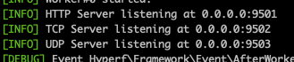

# Hyperf 运行各种网络服务

简单地运行起普通的 HTTP 服务之后，今天我们再来学习一下如何使用 Hyperf 运行 TCP/UDP 以及 WebSocket 服务。

之前我们通过原始的 Swoole 都已经搭建起过这些服务，其实和 HTTP 服务都差不多，只是修改一些参数或者监听的事件而已。在框架中，实现这些服务也是类似的，而且会更加简单，只需要进行一些简单的配置并给上监听事件的对象方法即可。毕竟原理都是相通的。

## TCP/UDP

在上一篇文章的学习中，我们其实就接触过一个配置文件，那就是 config/autoload/server.php 这个配置文件。当时我们是为了配置模板 View 对它下面两个参数的内容进行了配置，不知道大家有没有看这个文件的另一个参数数组 servers。

```php
'servers' => [
    [
        'name' => 'http',
        'type' => Server::SERVER_HTTP,
        'host' => '0.0.0.0',
        'port' => 9501,
        'sock_type' => SWOOLE_SOCK_TCP,
        'callbacks' => [
            Event::ON_REQUEST => [Hyperf\HttpServer\Server::class, 'onRequest'],
        ],
    ],
],
```

看出来什么端倪了吗？这就是一个服务配置呀。既然是这样的话，那么我们能不能通过它来配置其它的服务类型呢？当然是没问题的。

```php
[
    'name' => 'tcp',
    'type' => Server::SERVER_BASE,
    'host' => '0.0.0.0',
    'port' => 9502,
    'sock_type' => SWOOLE_SOCK_TCP,
    'callbacks' => [
        Event::ON_RECEIVE => [\App\Controller\TcpServer::class, 'onReceive'],
        Event::ON_CLOSE => [\App\Controller\TcpServer::class, 'onClose'],
    ],
],
[
    'name' => 'udp',
    'type' => Server::SERVER_BASE,
    'host' => '0.0.0.0',
    'port' => 9503,
    'sock_type' => SWOOLE_SOCK_UDP,
    'callbacks' => [
        Event::ON_PACKET => [\App\Controller\UdpServer::class, 'onPacket'],
    ],
],
```

我们添加了两个配置，分别就是 TCP 和 UDP 服务的配置，它们使用的 type 类型都是 Server::SERVER_BASE ，但 sock_type 则分别使用的是 SWOOLE_SOCK_TCP 和 SWOOLE_SOCK_UDP 。然后分别监听 9502 和 9503 两个端口，并且去指定不同的事件回调方法。注意，这里的 callbacks 中的事件回调类和方法不是框架默认的，是我们自定义的。

```php
// app/Controller/TcpServer.php
namespace App\Controller;

use Swoole\Coroutine\Server\Connection;
use Swoole\Server as SwooleServer;

class TcpServer implements \Hyperf\Contract\OnReceiveInterface
{

    /**
     * @inheritDoc
     */
    public function onReceive($server, int $fd, int $reactorId, string $data): void
    {
        $server->send($fd, 'recv：' . $data);
    }

    public function onClose($server, int $fd, int $reactorId){
        echo '连接关闭：' . $fd . ',' . $reactorId;
    }
}

// app/Controller/UdpServer.php
namespace App\Controller;

use Swoole\WebSocket\Server;

class UdpServer implements \Hyperf\Contract\OnPacketInterface
{

    /**
     * @inheritDoc
     */
    public function onPacket($server, $data, $clientInfo): void
    {
        var_dump($clientInfo);
        $server->sendto($clientInfo['address'], $clientInfo['port'], 'Server：' . $data);
    }
}
```

只要是跟我们之前一起学习过搭建这些服务的同学，对这一块应该不会很难理解。当时我们是直接将事件监听及操作写在回调函数中，而在这里，在框架中，则是 callbacks 这个回调数组的方式配置到配置文件中，然后当服务监听这些程序的时候，再将对应的监听类的方法传递给事件监听函数。

好了，现在运行起服务之后，你会发现 Hyperf 框架可以同时监听多个端口，之前我们的 HTTP 端口是可以正常访问的，同时，这些新定义的 TCP/UDP 服务也是没问题的。命令行中，我们也可以看到下面这样的信息表示监听端口开启。



剩下的，不管你是用 telnet/nc 命令，还是用之前我们写过的客户端程序，都可以进行测试啦。

## WebSocet

使用 Hyperf 的 WebSocket 客户端是需要额外的组件的，我们可以通过 Composer 来进行安装。

```php
composer require hyperf/websocket-server
```

安装完成后，就可以去配置服务了，依然还是在 config/autoload/server.php 中。

```php
[
    'name' => 'ws',
    'type' => Server::SERVER_WEBSOCKET,
    'host' => '0.0.0.0',
    'port' => 9504,
    'sock_type' => SWOOLE_SOCK_TCP,
    'callbacks' => [
        Event::ON_HAND_SHAKE => [Hyperf\WebSocketServer\Server::class, 'onHandShake'],
        Event::ON_MESSAGE => [Hyperf\WebSocketServer\Server::class, 'onMessage'],
        Event::ON_CLOSE => [Hyperf\WebSocketServer\Server::class, 'onClose'],
    ],
],
```

然后，我们就可以创建相关的控制器，注意，WebSocket 使用的事件监听程序是组件自带的，但是真实到达的控制器，还是需要我们实现的，这个服务其实和 HTTP 是很类似的。

```php
namespace App\Controller;

use Swoole\Http\Request;
use Swoole\Http\Response;
use Swoole\WebSocket\Frame;
use Swoole\WebSocket\Server;

class WebSocketController implements \Hyperf\Contract\OnMessageInterface, \Hyperf\Contract\OnCloseInterface, \Hyperf\Contract\OnOpenInterface
{

    public function onMessage($server, Frame $frame): void
    {
        $server->push($frame->fd, 'Recv: ' . $frame->data);
    }

    public function onClose($server, int $fd, int $reactorId): void
    {
        var_dump('closed');
    }

    public function onOpen($server, Request $request): void
    {
        $server->push($request->fd, 'Opened');
    }
}
```

控制器中实现对应的接口及方法，然后我们就去定义路由。

```php
Router::addServer('ws', function () {
    Router::get('/', 'App\Controller\WebSocketController');
});
```

这个路由的方法是 addServer() ，可以看做是增加一个 ws 协议的服务路由组。然后指定的是我们之前定义好的那个控制器。

最后，没别的多说的了吧，重新启动服务，你会看到现在我们的服务程序已经监听了 4 个端口了，并且也可以直接使用之前我们在 【Swoole系列2.2Http】 中的那个静态页来测试我们的 WebSocket 服务了。

## 总结

是不是总体感觉来看是要比纯手写 Swoole 的这些服务要方便一些呀。毕竟框架走了一层封装之后还是让我们更容易去使用这些服务了。如果你在日常工作中有这方面的需求，那还是需要更深入地去官方文档中进行更加详细的学习。

测试代码：

参考文档：

[https://hyperf.wiki/2.2/#/zh-cn/tcp-server](https://hyperf.wiki/2.2/#/zh-cn/tcp-server)

[https://hyperf.wiki/2.2/#/zh-cn/websocket-server](https://hyperf.wiki/2.2/#/zh-cn/websocket-server)
